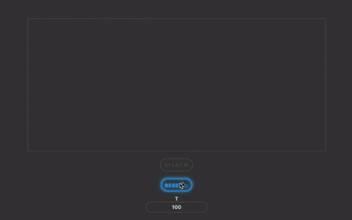

# Welcome to Interactive MCMC
 

<iframe src="https://www.w3schools.com">
  <p>Your browser does not support iframes.</p>
</iframe>
## Create a Graph

```js
//creating Nodes
let Node1 = new Node(1, 1);
let Node2 = new Node(2, 2);
let Node3 = new Node(4, 2);
//creating Edges
let Edge1 = new Edge(Node1, Node2);
let Edge2 = new Edge(Node3, Node2);
//Listing Nodes
let Nodes = [Node1,Node2,Node3]
let Edges = [Edge1,Edge2]
//Create Your Graph
let myGraph = new Graph(Nodes, Edges);
```
# Check Properties
```js
//Check if Connected
myGraph.isConnected()
//Check Weight
myGraph.getWeight()
```

That's all folks!
## License

Apache-2.0 © [Arkajit Mandal](MCMC,Graph,Connectivity)


[npm-image]: https://badge.fury.io/js/graph-mcmc.svg
[npm-url]: https://npmjs.org/package/graph-mcmc
[travis-image]: https://travis-ci.org/arkajitmandal/graph-mcmc.svg?branch=master
[travis-url]: https://travis-ci.org/arkajitmandal/graph-mcmc
[daviddm-image]: https://david-dm.org/arkajitmandal/graph-mcmc.svg?theme=shields.io
[daviddm-url]: https://david-dm.org/arkajitmandal/graph-mcmc
